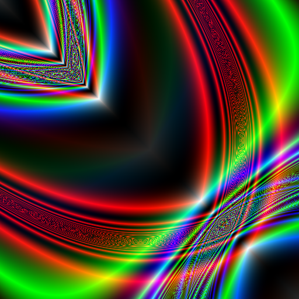
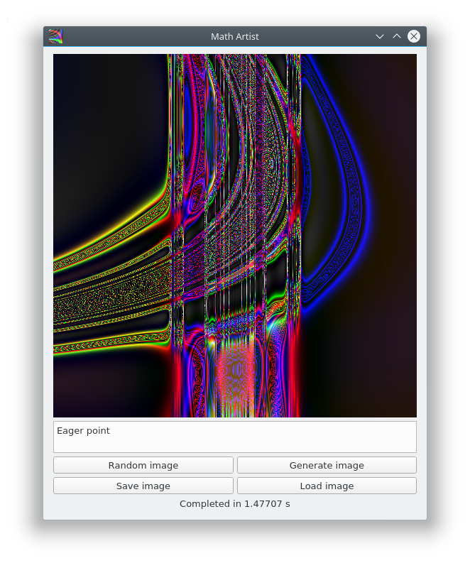
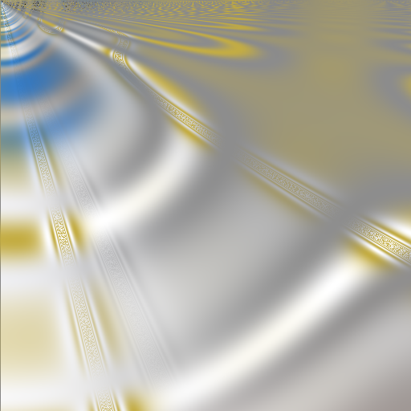
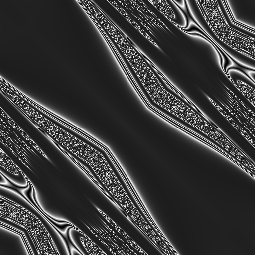
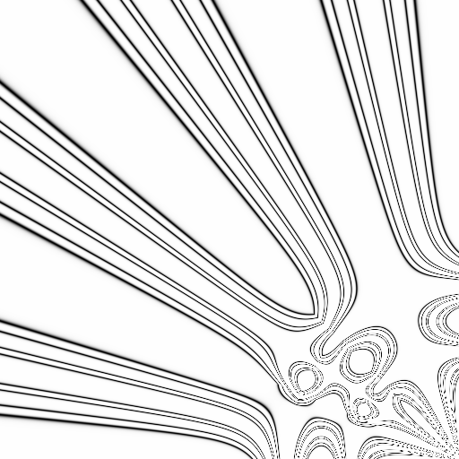
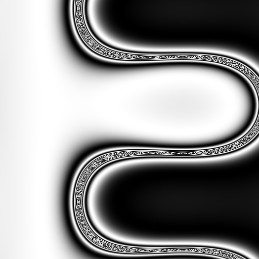
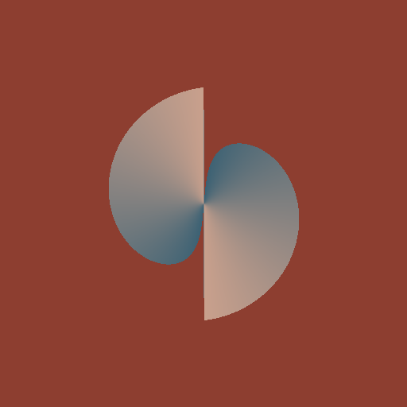
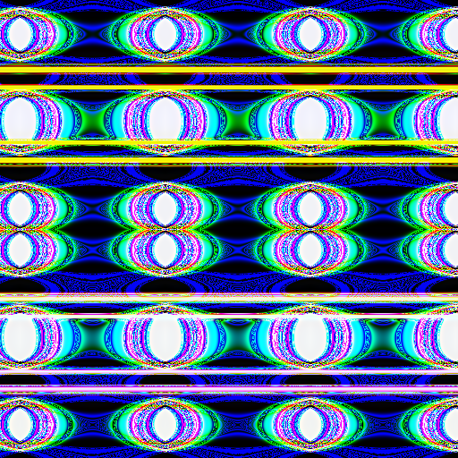
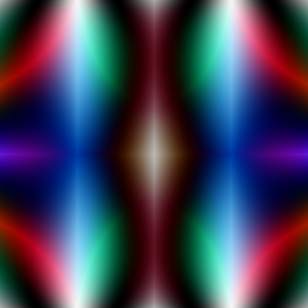
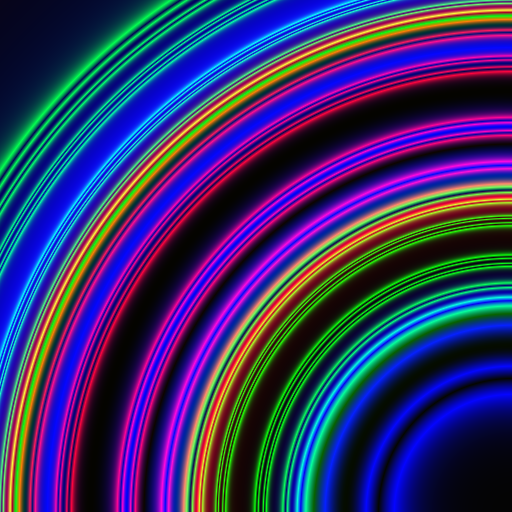

# MathArtist

Tool for generating pictures using mathematical formulas.



## Algorithm

To create new image we perform these steps:

* Generate name using data folder with mulltiple nouns, adjectives, prepositions and pronouns and [names_generator](names_generator.py) module to convert single words into fun looking image name.
* Select operators from predefined sets and coordinates conversion transformations. All coordinates are converted to range [-1, 1] because this range nicely fits to many mathematical operations. See [coords](coords.py) module for more information.
* Generate expression tree using operators from previous step that convert each (x, y) point to color. There are multiple operators from simplest VariableX (which converts coordinate to (x, x, x) color) to difficult Mix and Closest (you can see their code in [operators](operators.pyx) module). Tree size is dynamic so there can be something simple like Mix(x, y, Well(x)) or long multiline formula which computing can take some minutes.
* We also use [checker](checker.py) to check if generated formula is bad and recreate it. Checker is very simple - it thinks formula is good when it has different functions, has few well and tent functions (because they produce boring looking lines) and generates multicolor image (because the "Black square" by Malevich already exists). By the way sometimes checker decides that even bad formula should get a chance. It's not a bug, it's a feature.
* And now we convert each point of image to color using coordinates transform from step 2 and expression tree from step 3. After all points have their colors we can draw comleted image. That's all.

## Releases

<!-- TODO: add release builds link -->

## Requirements

This program uses Python 3 so you need to have Python 3 and pip for build and run it. To install them use instructions for your OS.

It also needs some extra libraries and applications such as argparse, PIL, numpy, PyQt5, pyinstaller and Cython. This program has script [build.sh](build.sh) for preparing and building binaries. So for installing requirements run:

```bash
bash build.sh prebuild
```

Of course you should have bash for running this script.

Some packages such as PyQt5 require additional packages on some OS. For example on deb-based systems you should also install python3-pyqt5:

``` bash
apt install python3-pyqt5 pyqt5-dev-tools
```

This tool also need C/C++ compiler because of using Cython. You can install it following instructions for your OS.

## Building

For making Cython modules you should run:

```bash
bash build.sh cython
```

Or for installing requirements and building Cython modules in one step you can run:

```bash
bash build.sh
```

### Pyinstaller

I prefer to use pyinstaller for building release versions. To build release run:

```bash
bash build.sh install
```

The release will be in dist folder.

## Usage

To run app from sources folder type:

```bash
python main.py
#or this if your python 3 has name python3:
python3 main.py
```

To run app from release build run double click on mathartist executable or run:

```bash
./mathartist
```

There are 2 work modes: console and GUI.

### Console

In console mode app generates one image, saves it and exits.

There are some extra modes:

```
usage: MathArtist [-h] [--console] [--name NAME] [--about] [--file FILE]
                  [--generate_list]

Tool for generating pictures using mathematical formulas.

optional arguments:
  -h, --help       show this help message and exit
  --console        Run in console mode (no window)
  --name           Set image name
  --about          Show about info
  --file FILE      Load file
  --generate_list  Generate operators' list (developer option)
```

### GUI

GUI in this app is pretty simple. There are 4 buttons: 

- "Random image" which generates new random name and image.

- "Generate image" which generates new image based on it's name in text field (same names produce same images).

- "Save image" which saves image in output folder.

- "Load image" which shows open file dialog to load text file with formula.

And 1 text field for image name.



#### Shortcuts

There are some hotkeys:

| Shortcut         | Command      |
| :--------------- | :----------- |
| <kbd>n</kbd>, <kbd>r</kbd>     | Generate new random image |
| <kbd>g</kbd>     | Generate new image based on it's name in text field |
| <kbd>o</kbd>     | Open text file with formula |
| <kbd>s</kbd> | Save image in output folder |
| <kbd>a</kbd> | Show about info |
| <kbd>Esc</kbd>     | Close app |
| <kbd>F1</kbd>     | Show online help (this readme) |

### Samples

<p float="left">
  
  
  
</p>
<p float="left">
  
  
  
</p>
<p float="left">
  
  
  
</p>

There is samples folder with some nice images in text format. You can use app's read file option ("Load image" button in GUI) to convert these texts into images.

## Online content

Math Artist also has it's own Twitter (https://twitter.com/math_artist) and Instagram (https://www.instagram.com/qarmath/) accounts. You are welcome to follow, like, repost and comment.

## License

In short the MathArtist uses GNU GPL3. For more information see the LICENSE file.

But there is one nuance. This program uses some code from Andrej Bauer's randomart project. Original randomart project is licensed with BSD 2-clause license. You can download it here - http://math.andrej.com/2010/04/21/random-art-in-python/

Andrej Bauer's code in this project is licensed with both BSD 2-clause and GNU GPL3 licenses. The combined project uses only GNU GPL3. You shouldn't use any part of MathArtist with BSD license. Please use GNU GPL3 only.

## Thanks

I'd like to thank:

Andrej Bauer for wonderful online random art project (http://www.random-art.org/online/), original Python randomart code (http://math.andrej.com/2010/04/21/random-art-in-python/) and great ideas which lead to this project.

Matt DesLauriers for cool color-wander project (http://color-wander.surge.sh/ and https://github.com/mattdesl/color-wander) and nice palettes used in this project.

Volodymyr Shymanskyy for his JS randomart project (https://github.com/vshymanskyy/randomart) that gave me some ideas such as mindepth and some operators.

Halvor Kjærås for random art generator - (http://ironigardinen.net/generatorer/art2/index.html). It gave me some ideas and data for MathArtist art name generator.
